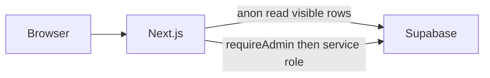

# Portfolio site — Phase 1

Source of truth: [portfolio.md](portfolio.md), with the contact-link rules below overriding §2 and §5 for socials and phone/email. Greenfield app in the current directory. **Phase 1 only.** No Gemini calls and no GitHub API calls. `cv_uploads` and `cv_proposals` are created now so Phase 2 does not need a schema rewrite.

Build order: scaffold, then database migration, then public site, then `/login` and admin.

## Contact and links (overrides the spec seed)

No social or contact values are seeded. `social_links` starts empty. `profile.email`, `profile.phone`, and `profile.show_phone` stay null / false and are not rendered. Date of birth is never stored or published.

All links and contact methods are created after login at [`/admin/socials`](/admin/socials):

- Platforms: Facebook, Instagram, TikTok, LinkedIn, GitHub, WhatsApp, Phone, Email, plus **Other** (custom label required).
- Per row: add, edit, delete, replace, visibility toggle, drag-to-reorder (`sort_order`).
- Zod validation: http(s) URLs for the social platforms and Other; email format for Email; a phone number for Phone and WhatsApp.
- Stored value is what Omar types. Public href is derived: Email → `mailto:`, Phone → `tel:`, WhatsApp → `https://wa.me/{digits}`.
- The admin page shows a live preview of the hero icon row using the same renderer as the public site.

Public rendering (hero icon row, Contact section, footer), from rows where `visible = true`, ordered by `sort_order`:

- A platform with no row, or with `visible = false`, is omitted. No empty icons and no placeholder links.
- If zero visible links exist, the social row, contact-link block, and footer link row are not rendered.
- Phone and WhatsApp appear only when Omar adds them and turns visibility on.
- **Download CV** is shown only when a public CV file has been uploaded in admin.

## Other assumptions

- **The Knower OS** and **OppStore** are seeded as About text (founder work), not as links.
- Project `github_repo` and `live_url` start null. Cards show a “Client project” badge until a URL is added in admin. No GitHub API.
- Arabic is out of scope. Layout uses logical CSS properties so a later RTL pass is possible.
- Dark default, light toggle, deep burgundy accent, mobile-first.
- Domain unset. QR code is generated only after a real site URL exists.
- Rate limiting uses `login_attempts` (5 failures / 15 minutes / IP). Upstash is not required for Phase 1.
- Content seed from §2 with fixes: “Children”, “Egyptian”, summary as a current IT student (2024–2028). Ongoing roles use `is_current` and a null `end_date`.

## What you need to provide, and when

Nothing is required to start the scaffold or to write the SQL migration in the repo.

**Before the app can run against your database** (after scaffold + migration files exist):

- A Supabase project.
- `NEXT_PUBLIC_SUPABASE_URL`
- `NEXT_PUBLIC_SUPABASE_ANON_KEY`
- `SUPABASE_SERVICE_ROLE_KEY` (server only; never `NEXT_PUBLIC_`)

Put them in `.env.local`. Signups stay disabled. Create the single admin user in the Supabase dashboard and enroll TOTP before testing `/login`.

**Not needed for Phase 1:** `GEMINI_API_KEY`, `GEMINI_MODEL`, `GITHUB_TOKEN`, Upstash URL/token.

**Before deploy:** a Vercel project and the same three Supabase vars plus `NEXT_PUBLIC_SITE_URL`. Photo, public CV, and every social/contact link are uploaded by you in admin after the first login — they are not part of setup.

## 1. Scaffold

- Next.js App Router, TypeScript, Tailwind, shadcn/ui, Framer Motion for light section reveals, Zod, `@dnd-kit` for reorder.
- Layout from §4: `app/(public)`, `app/login`, `app/admin`, `app/api`, `components`, `lib/supabase`, `lib/validators.ts`, `middleware.ts`, `supabase/migrations`.
- `.env.example` lists the Phase 1 vars. `.env.local` is gitignored. No secrets in the repo or the client bundle.

## 2. Database

One migration for §5 tables: `profile`, `social_links`, `experiences`, `education`, `projects`, `skills`, `certifications`, `courses`, `achievements`, `cv_uploads`, `cv_proposals`, `login_attempts`.

`social_links` columns: `id`, `platform` (`facebook | instagram | tiktok | linkedin | github | whatsapp | phone | email | other`), `label` (required when `platform = other`), `value` (URL, email, or number), `sort_order`, `visible`. No seed rows.

RLS:

- Content tables: `anon` `select` only where `visible = true`.
- `profile`: anon can read the single row; `email` and `phone` are not selected by the public client.
- No insert/update/delete for `anon` or `authenticated`.
- `cv_uploads`, `cv_proposals`, `login_attempts`: no client access.
- Storage: public bucket for the hero photo and the downloadable CV; private bucket for future AI CV PDFs (unused in Phase 1). Public CV and images: PDF or image types, 10 MB, MIME checked on the server.

Seed §2 content only: profile name, title, location, corrected summary; experience, education, projects, skills, certifications, courses, achievements. No email, phone, or social URLs.

## 3. Data access

- Public pages: server components, anon key, ISR.
- Every write is a server action that calls `requireAdmin()` (valid session and AAL2) and then uses the service-role client. Middleware on `/admin` is only the first gate.

## 4. Public site

`/`: Hero, About, Experience timeline, Projects (software/hardware filter), Skills, Certifications and Courses, Achievements, Contact, footer.

`/projects/[slug]`: brief, description, tech, dates, live/GitHub links only when set, otherwise the client-project badge, cover when set.

Hero: photo or neutral fallback, name, title, pitch, View projects, Download CV only if a public CV exists, Contact. Social icons only for visible links.

Theme, SEO (title, description, Open Graph, JSON-LD `Person` without phone or birth date), `robots.txt` disallowing `/login` and `/admin`, `X-Robots-Tag: noindex` on those routes. `/login` is not linked from any public page.

## 5. Login and admin

- `/login`: email + password, then TOTP. Generic error text. No register and no forgot-password UI.
- Rate limit: 5 attempts / 15 minutes / IP in `login_attempts`; the 6th is blocked. Log success and failure.
- Headers: CSP, `X-Frame-Options: DENY`, `Referrer-Policy`, `X-Content-Type-Options`.
- `/admin`: counts and links to each section.
- `/admin/socials`: the single page for every link and contact method, with drag-reorder, visibility, Zod checks, and live preview.
- `/admin/profile`: name, title, summary, location, photo upload, public CV upload (this file powers Download CV).
- `/admin/{experience,education,projects,skills,certifications,courses,achievements}`: add, edit, delete, hide, drag-reorder. Project covers upload to the public bucket.

## 6. Phase 1 checks

- Seed has §2 content and zero contact/social values.
- With an empty `social_links` table, hero, contact, and footer show no link UI.
- After adding a hidden link, it stays off the public site; after enabling it, it shows in all three places with the correct href.
- `/login` unlinked and `noindex`. `/admin` requires password and TOTP.
- Sixth failed login in the window is blocked.
- Date of birth is absent. No service-role key in the client bundle.
- Browser pass on `/` and one project page, desktop and mobile: filters, theme, empty-links state.

## Later (not this build)

Phase 2: GitHub metadata sync and the AI CV propose/approve flow on the tables already migrated. Phase 3: Arabic toggle, blog, analytics, contact form, CV generated from the database.
