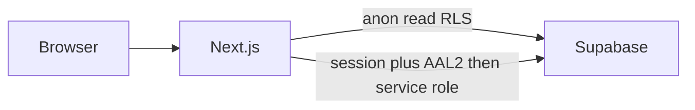

# Portfolio site from the spec

Source of truth: [portfolio.md](portfolio.md). The workspace is empty besides that file, so this is a greenfield app in the current directory.

## Assumptions (open items in §14)

- **No contact or social values are seeded.** Email, phone, WhatsApp, Facebook, Instagram, TikTok, LinkedIn, and GitHub start empty. Omar adds them in `/admin/socials` after login.
- **The Knower OS** and **OppStore** appear in the About summary as founder work.
- **GitHub repos** start empty. Client/private projects show a “Client project” badge. Repo links are added later in admin.
- **Arabic** is Phase 3. Typography and layout stay RTL-ready (logical properties, `dir` on the root).
- **Accent** is a deep burgundy on a neutral dark-first theme, with a light toggle.
- **Domain** is unset. Use `NEXT_PUBLIC_SITE_URL` and generate the QR after the Vercel URL (or custom domain) exists.
- **Rate limiting** uses the `login_attempts` table first. Add Upstash only if those env vars are present.
- Supabase project, Auth user, TOTP, and Vercel env vars are created by Omar in the dashboards. The app will not invent keys.

Content fixes from §2 before seed: “Children”, “Egyptian”, summary rewritten as a current IT student (2024–2028), no date of birth. Overlapping future end dates stay as `is_current` when the CV says current; others keep the written end date.

## Phase 1 — public site and admin (MVP)

### 1. Scaffold

- Next.js App Router + TypeScript, Tailwind, shadcn/ui, Framer Motion (section reveals only), Zod.
- Folder layout from §4: `app/(public)`, `app/login`, `app/admin`, `app/api`, `components`, `lib/supabase`, `lib/validators.ts`, `middleware.ts`, `supabase/migrations`.
- Env template matching §11 (no secrets committed). `.env.local` stays gitignored.

### 2. Database and seed

One migration for the tables in §5 (`profile`, `social_links`, `experiences`, `education`, `projects`, `skills`, `certifications`, `courses`, `achievements`, `cv_uploads`, `cv_proposals`, `login_attempts`).

RLS:

- Content tables: `anon` may `select` only where `visible = true` (and profile is a single public row with phone redacted unless `show_phone`).
- No insert/update/delete policies for `anon` or `authenticated`.
- `cv_uploads`, `cv_proposals`, `login_attempts`: no client access.
- Storage: public bucket for images, private bucket for CV PDFs (PDF only, 10 MB).

Seed from §2, including software and hardware projects, with slugs derived from titles. Profile summary uses the corrected “IT student” wording. `profile.email`, `profile.phone`, and `social_links` are left empty.

`social_links` columns: `platform` (`facebook | instagram | tiktok | linkedin | github | whatsapp | phone | email | other`), `label` (required for `other`), `value` (raw input), `url` (resolved href), `sort_order`, `visible`. Zod builds `https://wa.me/…` for WhatsApp, `tel:` for phone, and `mailto:` for email. Public hero, contact, and footer read only visible rows. If none exist, those blocks are omitted.

### 3. Data access

- Public pages: server components, anon client, ISR.
- Writes: server actions that call `requireAdmin()` (valid session **and** AAL2), then the service-role client. Middleware on `/admin` and `/api/cv` is a first gate only; actions re-check.

### 4. Public UI

Single page `/` sections: Hero, About, Experience (timeline), Projects (software/hardware filter, cards), Skills, Certifications and Courses, Achievements, Contact.

`/projects/[slug]`: brief, description, tech, dates, GitHub/live links or client badge, cover.

Hero: name, title, one-line pitch, View projects / Download CV / Contact, social row. Photo uses `photo_url` with a neutral fallback until a real photo is uploaded.

Dark default, light toggle, burgundy accent, mobile-first. SEO: metadata, Open Graph, JSON-LD `Person`, `robots.txt` disallowing `/login` and `/admin`, `X-Robots-Tag: noindex` on those routes.

### 5. Auth and admin

- `/login`: email + password, then TOTP. Not linked from the public site. Generic failure text. No register or forgot-password UI.
- Rate limit: 5 attempts / 15 minutes / IP via `login_attempts`, then block. Log success and failure.
- Security headers in middleware: CSP, `X-Frame-Options: DENY`, `Referrer-Policy`, `X-Content-Type-Options`.
- `/admin`: counts and quick links.
- `/admin/socials`: one page for every link and contact item. Add, edit, delete, replace, visibility, drag-to-reorder, Zod URL rules, and a live preview of the public row.
- `/admin/{profile,experience,education,projects,skills,certifications,courses,achievements}`: create, edit, delete, visibility toggle, reorder. Profile includes photo upload, public CV upload (Download CV), and summary. Projects accept cover upload to the public bucket.
- Zod validators for every form.

### 6. Ship checklist (Phase 1 acceptance)

- Seed content matches §2 after the cleanup notes.
- `/login` unlinked and `noindex`. `/admin` requires password and TOTP.
- Sixth failed login in the window is blocked.
- No social or contact rows in the seed. Public hero, contact, and footer render only visible links from `social_links`. Empty or hidden platforms do not render. Phone and WhatsApp appear only after Omar adds them and turns visibility on.
- Date of birth is absent.
- No service role, Gemini, or GitHub token in the client bundle.
- Browser pass on `/` and one project page (mobile and desktop): nav, filters, theme toggle, CV link.
- Deploy to Vercel after env vars are set; QR code generated for the live URL.

Phase 1 does **not** call Gemini or GitHub yet. CV upload tables exist so Phase 2 does not need a schema rewrite.

## Phase 2 — AI CV updater and GitHub

After Phase 1 is accepted:

- `lib/github.ts`: fetch repo metadata, ISR ~1 hour, admin Sync. Optional “Latest from GitHub” strip stays off until repos are mapped.
- Optional later: “Generate brief” from README, “Suggest summary”.
- CV flow in §8: upload PDF → private storage → `cv_uploads` → Gemini with Zod schema → one retry → `lib/ai/diff.ts` (add/update only; never delete) → review UI → `POST /api/cv/apply` in a transaction.
- Rate limit uploads (~10/hour), 10 MB, log model and token usage.

## Phase 3 — later, not in the first build

Arabic/English toggle, blog, analytics, contact form, CV generated from the database.
